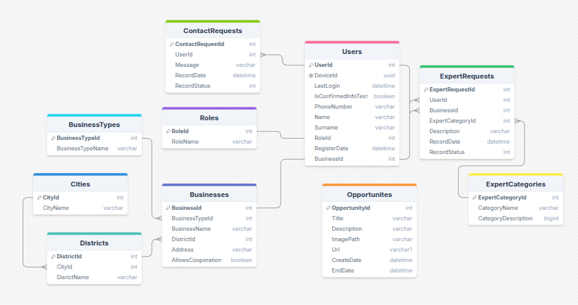

# Esnafa Gelir Mobile-Web Project

<div align="center">
  
</div>

---

This project is a **efficient web application** developed using **ASP.NET Core MVC**. The interface is **optimized for mobile devices**, fully complying with **Figma designs**, and seamlessly integrated with **React Native WebView**.

---

## 🚀 Key Features

### **User Login and Registration**

- Properly optimized validation for every form submission.
- Only **one admin account** can be created at a time.

### **Mobile Optimization**

- UI optimized **exclusively for mobile devices**.
- **Figma designs** implemented flawlessly.
- Modern and responsive design achieved using **Tailwind CSS**.
- Enhanced user experience with dynamic animations.

### **WebView Integration**

- Integrated with a mobile application via **React Native WebView**, rendering the web UI seamlessly.
- Access is restricted via a **dynamic `deviceId`** parameter (`/login/Index?deviceId=xxx`), preventing unauthorized access.
- A separate endpoint for the Admin Panel (`/AdminPanel/Login?DeviceId=xxx`).
- An endpoint available **only when the app is first launched**, allowing the creation of a new admin account (`/AdminPanel/addAdmin?DeviceId=xxx`).

### **Session and Security**

- User session management handled through **session storage**.
- `DeviceId` is linked to the user’s device identity in the database.
- Secure connection ensured through **cookie and CORS settings**.

---

### Admin Panel

<div align="center">
    
</div>

---

## 📂 Project Details

### **Technologies Used**

- **ASP.NET Core MVC**: Application framework.
- **Entity Framework Core**: ORM for database operations.
- **Fluent Validation**: Form validation and error handling.
- **AutoMapper**: DTO and ViewModel transformations.
- **Tailwind CSS**: Modern and responsive styling.
- **SQL Server**: Database management.

### **Security Measures Implemented**

- Prevented simultaneous admin account creation.
- Access is only possible using a **dynamic `deviceId`** parameter.
- Password validation enforces strict requirements (uppercase, digit, special character, etc.).

---

## 🛠 Installation and Running

### 1. Required Tools

To run the project, ensure you have the following installed:

- [Visual Studio Code](https://code.visualstudio.com/) or [Visual Studio](https://visualstudio.microsoft.com/)
- .NET 8.0 SDK
- SQL Server

### 2. Clone the Repository

```bash
git clone https://github.com/kasimpasaoglu/esnafagelir-mobilweb.git
cd esnafagelir-mobilweb
```

### 3. Set Up the Database

Run the **createdb.sql** script to set up the necessary database schema.
<div align="center">
  
</div>

### 4. Run the Project

```bash
dotnet run
```

---

## 🌐 React Native Integration

This project is integrated with a **React Native Expo-based mobile application**, rendering the MVC project via **WebView**. For detailed information, refer to the mobile repository:

[React Native Project](https://github.com/kasimpasaoglu/EsnafaGelir-ReactNative)

---

## 📄 License

This project is licensed under the MIT License.
